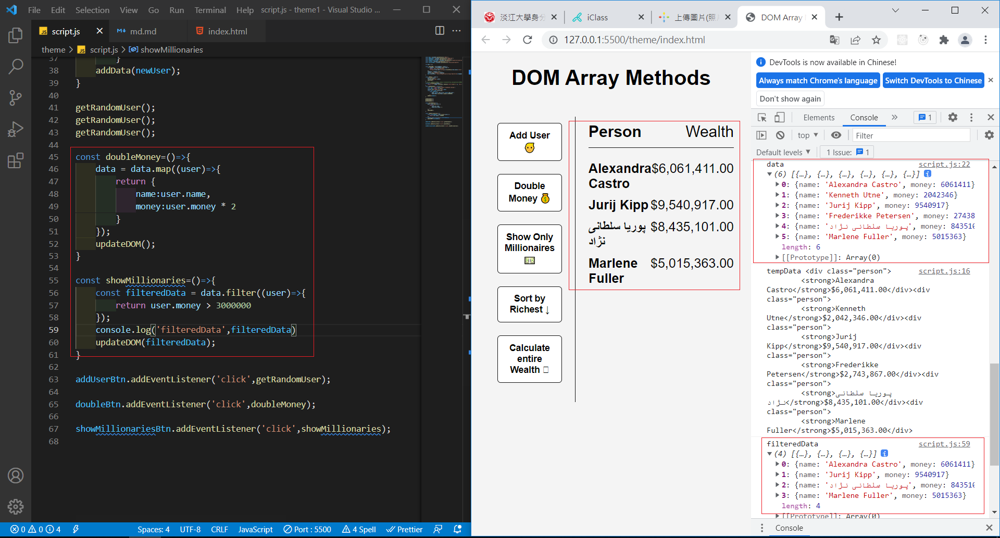
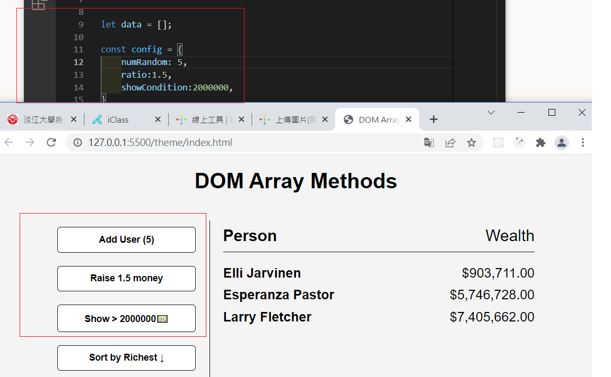

### P1: fruits array demo using map,filter,find,reduce


### P2: get random User three times


### P3: add 6 users to the DOM


### P4: add 6 users first, then filter condition set to > 30000000



### P5: use config for three buttons



```js
const config = {
  numRandom: 5,
  ratio: 1.5,
  showCondition: 2000000,
};
```
