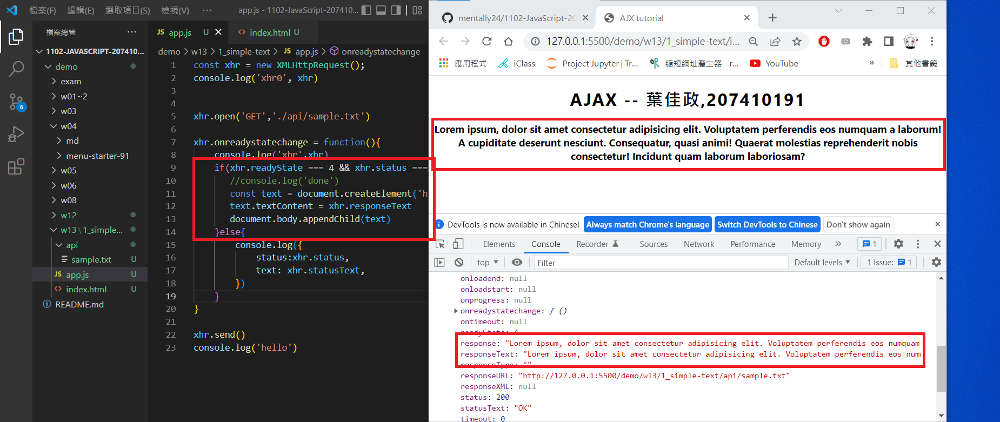
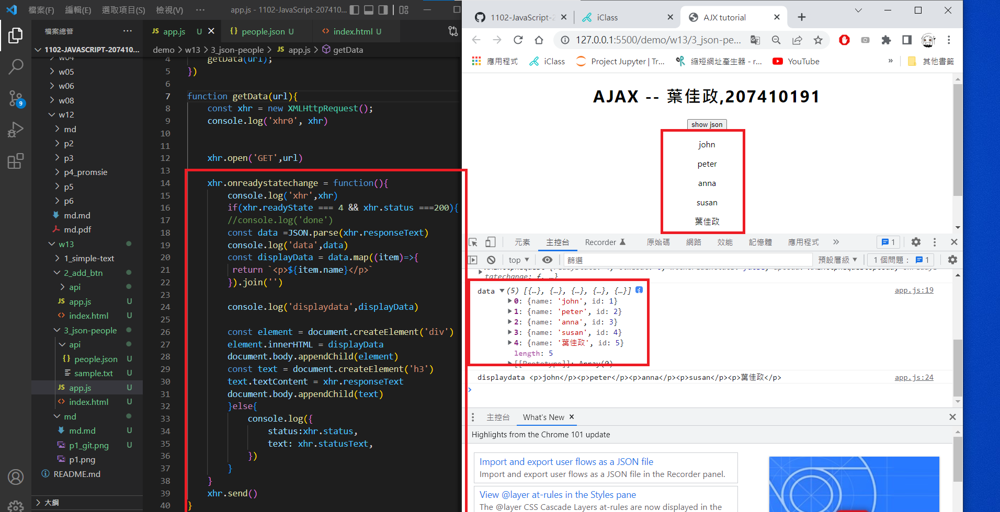
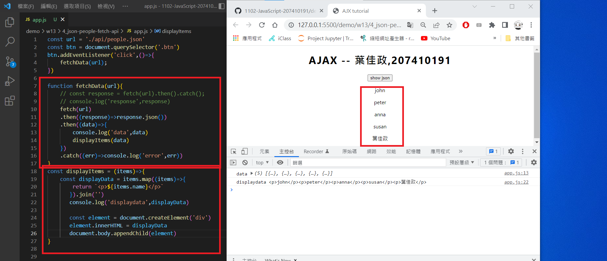
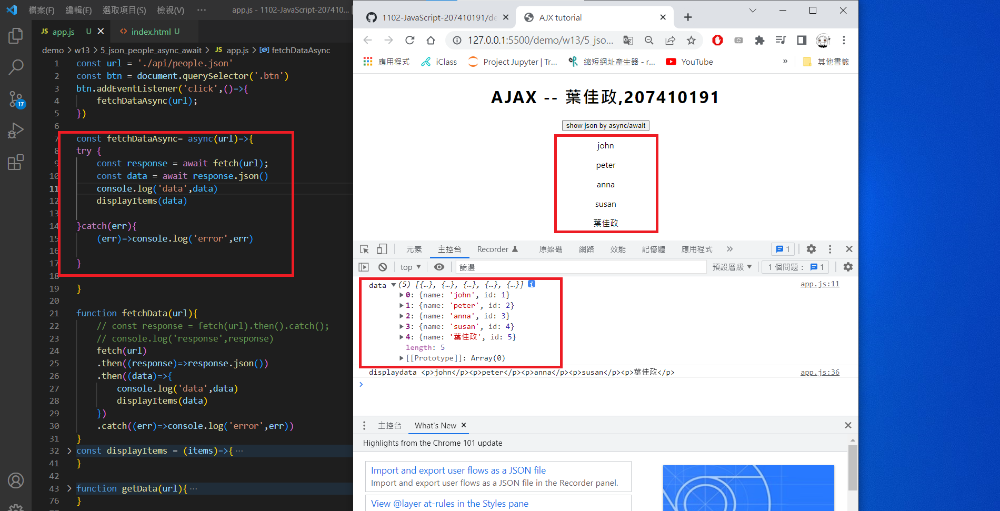
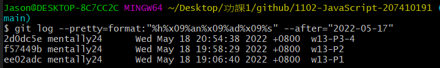

### w13-p1: use xhr object to get sample.txt, and show it on webpage




### w13-p2: use xhr object to get people.json, and show it on webpage


### w13-p3: use fetch api to get people.json, and show it on webpage

|

### w13-p4: use async/await to get people.json, and show it on webpage



### w13-p5


### w13-p6 git log

```
$ git log --pretty=format:"%h%x09%an%x09%ad%x09%s" --after="2022-05-17"
2d0dc5e mentally24      Wed May 18 20:54:38 2022 +0800  w13-P3-4
f57449b mentally24      Wed May 18 19:58:29 2022 +0800  w13-P2
ee02adc mentally24      Wed May 18 19:06:40 2022 +0800  w13-P1

```