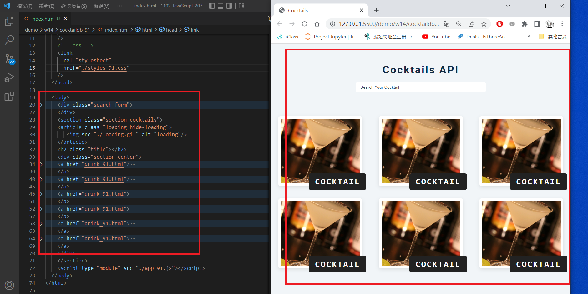
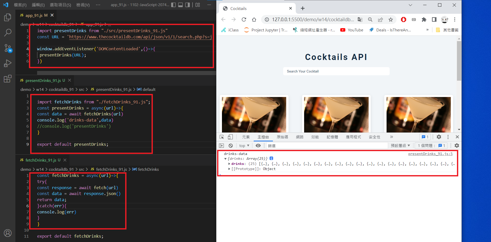

### w14-p1: use create html themne for Cocktail API demo

 


```
$ git log --pretty=format:"%h%x09%an%x09%ad%x09%s" --after="2022-05-24"
8e628ad mentally24      Wed May 25 19:11:00 2022 +0800  w14-p1

```

### w14-p2: fetch data from given url

