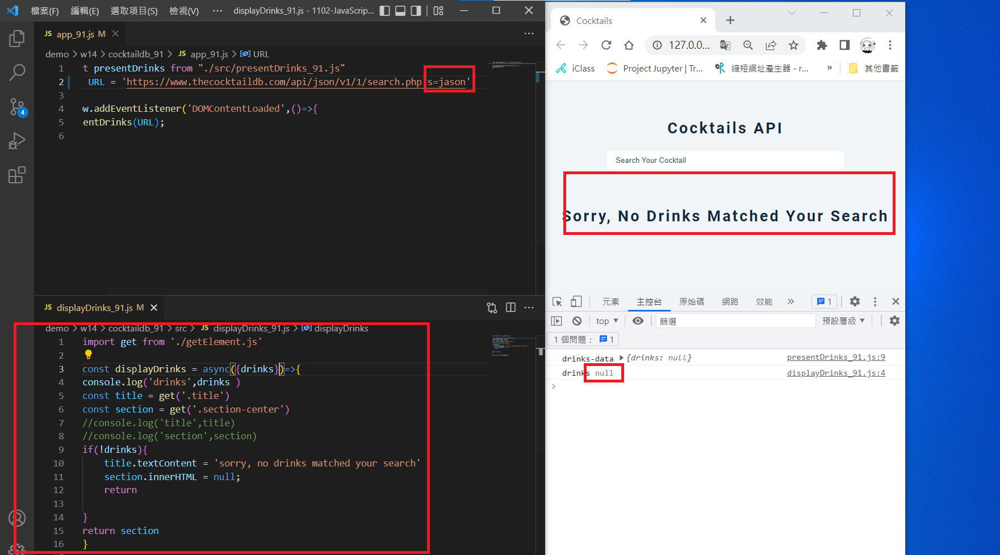

### w14-p1: use create html themne for Cocktail API demo

 


### w14-p2: fetch data from given url


### w14-p3: fetch drinks, get null, show no drinks matched




```
$ git log --pretty=format:"%h%x09%an%x09%ad%x09%s" --after="2022-05-24"
4b2b4e6 mentally24      Wed May 25 20:18:00 2022 +0800  w14-p3
70d7938 mentally24      Wed May 25 19:51:30 2022 +0800  w14-p2
8e628ad mentally24      Wed May 25 19:11:00 2022 +0800  w14-p1


```

