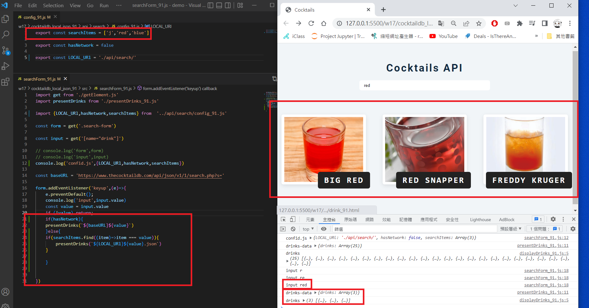
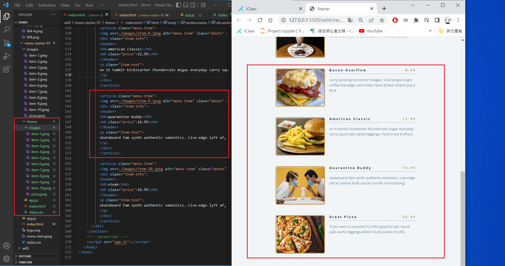

### w17-p1: fetch local json data when hasNetwork=false

### w17-p2: fetch a local json data with local images


### w17-p3: search items that is available in searchItems array



### w17-p4: do Week 4 classdemo for menu theme




```
$ git log --pretty=format:"%h%x09%an%x09%ad%x09%s" --after="2022-06-14"
846ff39 mentally24      Wed Jun 15 20:38:03 2022 +0800  w17-03
8297fe3 mentally24      Wed Jun 15 19:57:31 2022 +0800  w17-02
4c3fa12 mentally24      Wed Jun 15 19:41:39 2022 +0800  w17-02
cf71a2d mentally24      Wed Jun 15 19:11:55 2022 +0800  w17-01


```