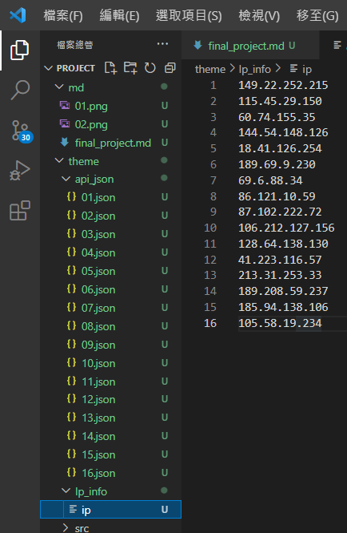

### s1-1利用IPbase api網站獲取所需的資訊，其中的IP位址是通過網路上隨機IP搜尋到的值


### s1-2利用所搜尋到的資料建立JSON檔案


### s1-3從第一個到最後一個共選了16組資料來做網頁



### s1-4因為做的是介紹國家城市的網頁所以拿第四周menu_starter的來改


### s1-5預計效果 棕色(標題) 紫色(分類) 紅色(該城市的圖片) 橘色(城市) 綠色(使用的錢幣)藍色(使用的IP為何)


### s2-1從網路上抓取每個城市對應的照片


### s2-2標題和按鈕修改成所需要的文字


### s2-3預期所呈現之效果


### s2-4參考W04檔案做出來的結果


### s2-5參考W04檔案做出來的按鈕


### gitlog


### 自主學習

### A-1 在找尋資料的路徑圖中利用陣列來找尋資料
```
${item.data.location.country.currencies[0].name}
```
### A-2 參考week4的網頁修改成自己想要的格式

### A-3 參考W04的網頁做出想要的模板


```
$ git log --pretty=format:"%h%x09%an%x09%ad%x09%s" --after="2022-06-18"
f666008 mentally24      Sun Jun 19 01:30:29 2022 +0800  final_project s2-5
e1382b1 mentally24      Sun Jun 19 00:46:57 2022 +0800  final_project s2-5
3f0e660 mentally24      Sun Jun 19 00:12:41 2022 +0800  final_project s2-4
5fad59b mentally24      Sat Jun 18 22:31:24 2022 +0800  final_project s2-3
8de24a7 mentally24      Sat Jun 18 21:03:49 2022 +0800  final_project s2-2
d4b5aab mentally24      Sat Jun 18 21:00:02 2022 +0800  final_project s2-1
5349390 mentally24      Sat Jun 18 20:29:31 2022 +0800  final_project s1-1~1-5
f4106d2 mentally24      Sat Jun 18 20:20:05 2022 +0800  final_project s1-1

```
