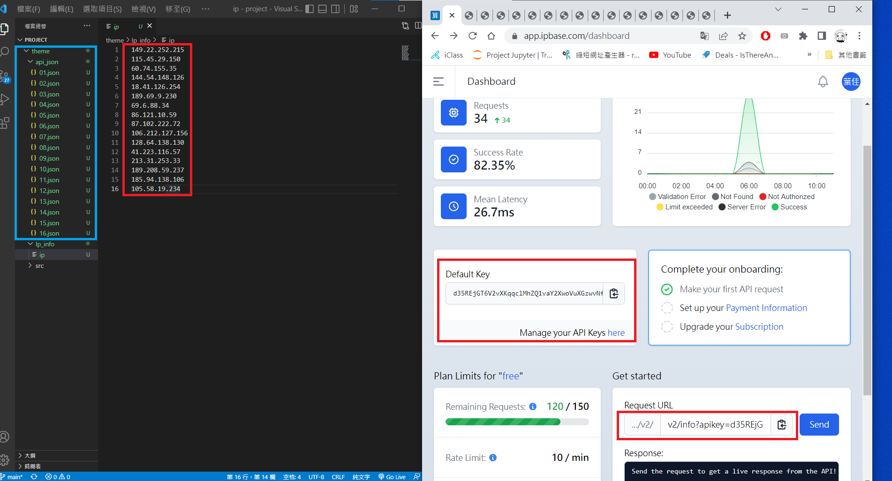
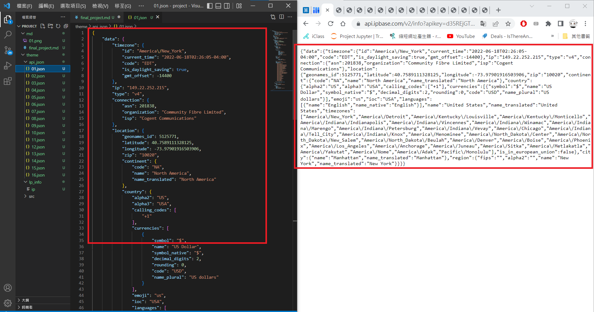
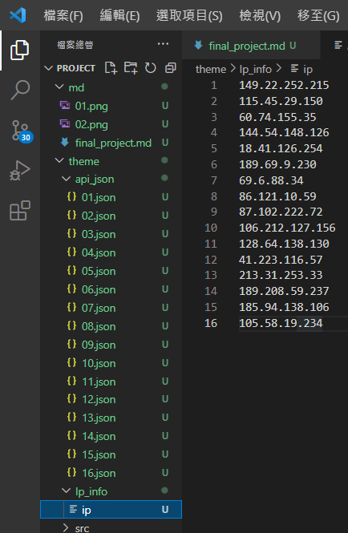
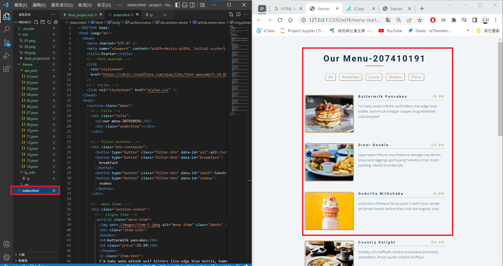
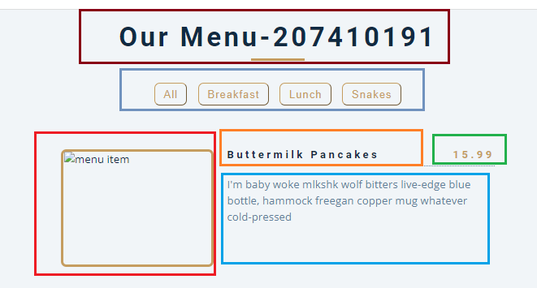

### s1-1利用IPbase api網站獲取所需的資訊，其中的IP位址是通過網路上隨機IP搜尋到的值

### s1-2利用所搜尋到的資料建立JSON檔案

### s1-3從第一個到最後一個共選了16組資料來做網頁

### s1-4因為做的是介紹國家城市的網頁所以拿第四周menu_starter的來改

### s1-5預計效果 棕色(標題) 紫色(分類) 紅色(該城市的圖片) 橘色(城市) 綠色(使用的錢幣)藍色(城市簡述)

### s1-5利用所搜尋到的資料建立JSON檔案
